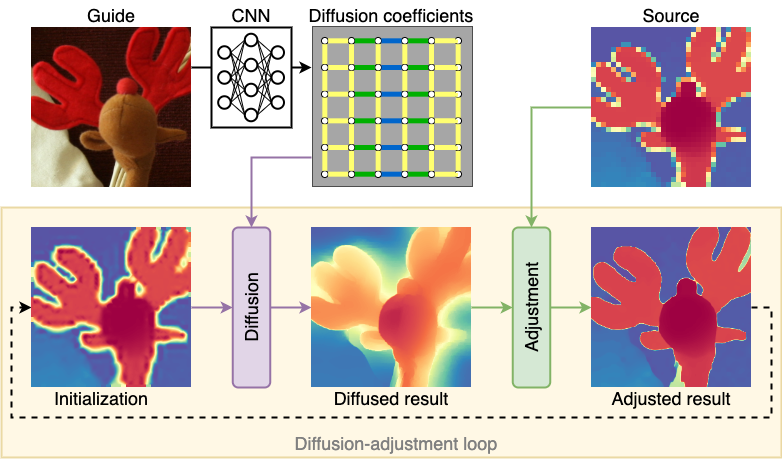

<p align="center">
<h2 align="center"> Guided Depth Super-Resolution by Deep Anisotropic Diffusion [CVPR2023] </h2>

<p align="center">
    <a href="https://nandometzger.github.io/"><strong>Nando Metzger</strong></a>*,
    <a href="https://rcdaudt.github.io/"><strong>Rodrigo Caye Daudt</strong></a>*,
    <a href="https://igp.ethz.ch/personen/person-detail.html?persid=143986"><strong>Konrad Schindler</strong></a>
</p>

<p align="center">
{nando.metzger, rodrigo.cayedaudt, schindler}@ethz.ch, Photogrammetry and Remote Sensing, ETH Zürich
</p>
<p align="center">
*Equal Contribution
</p>
<p align="center">
<a href="https://arxiv.org/abs/2211.11592"><strong>Read the Paper</strong></a>
</p>
  
Performing super-resolution of a depth image using the guidance from an RGB image is a problem that concerns several fields, such as robotics, medical imaging, and remote sensing. While deep learning methods have achieved good results in this problem, recent work highlighted the value of combining modern methods with more formal frameworks. In this work we propose a novel approach which combines guided anisotropic diffusion with a deep convolutional network and advances the state of the art for guided depth super-resolution. The edge transferring/enhancing properties of the diffusion are boosted by the contextual reasoning capabilities of modern networks, and a strict adjustment step guarantees perfect adherence to the source image. We achieve unprecedented results in three commonly used benchmarks for guided depth super resolution. The performance gain compared to other methods is the largest at larger scales, such as x32 scaling. Code for the proposed method will be made available to promote reproducibility of our results.




## 🛠️ Setup

### 🐍💓 Dependencies
We recommend creating a new conda environment with all required dependencies by running
```bash
conda env create -f environment.yml
conda activate DADA-SR
```

### 💾🦌 Data
To reproduce our results, create a data directory (e.g. `./datafolder`) with the three datasets:
* **Middlebury**: Download the 2005-2014 scenes (full size, two-view) from [[here]](https://vision.middlebury.edu/stereo/data/) and place the extracted scenes in `./datafolder/Middlebury/<year>/<scene>`. For the 2005 dataset, make sure to only put the scenes for which ground truth is available. The data splits are defined in code.
* **NYUv2**: Download the labeled dataset from [[here]](https://cs.nyu.edu/~silberman/datasets/nyu_depth_v2.html) and place the `nyu_depth_v2_labeled.mat` in `./datafolder/NYU Depth v2`, the split file is already provided in this repository at `data/split_idc_nyuv2.json`.
* **DIML**: Download the indoor data sample from [[here]](https://dimlrgbd.github.io) and extract it into `./data/DIML/{train,test}` respectively. Then run `python scripts/create_diml_npy.py ./datafolder/DIML` to create numpy binary files for faster data loading.

Your folder structure should look like this:
```
datafolder
└───Middlebury
│   └───2005
│   │   └───Art
│   │   |   |   disp1.png
│   │   |   |   disp5.png
│   │   |   |   dmin.text
│   │   |   └───Illum1
│   │   |   └───Illum2
│   │   |   └───Illum3
│   │   │   ...
│   └───...
│   
└───NYUv2
│       nyu_depth_v2_labeled.mat
│
└───DIML
│   └───train
│   │   └───HR
│   │   └───LR
│   └───test
│   │   └───HR
│   │   └───LR
│   └───npy
│       <...will be generated by create_diml_npy.py...>

```

### 🚩💾 Checkpoints
Our pretrained model checkpoints can be downloaded [here](https://drive.google.com/file/d/1pfJ94vkDl6OQQ4QYItRxEbEjPhalrs_5/view?usp=share_link).

## 🏋️ Training

Run the training script via
```bash
python run_train.py --dataset Middlebury --data-dir ./datafolder/ --save-dir ./save_dir/ --wandb --num-epochs 4500 --scaling 8 --val-every-n-epochs 10 --lr-step 100 --in-memory
python run_train.py --dataset NYUv2 --data-dir ./datafolder/ --save-dir ./save_dir/ --wandb --num-epochs 550 --scaling 8 --val-every-n-epochs 4 --lr-step 10 --in-memory
python run_train.py --dataset DIML --data-dir ./datafolder/ --save-dir ./save_dir/ --wandb --num-epochs 300 --scaling 8 --val-every-n-epochs 2 --lr-step 6 --in-memory
```
or use the prepared setups in ```.vscode/launch.json```. 

Note, that depending on the dataset, you have to adjust the number of epochs (`--num-epochs`) and the scheduler step size (`--lr-step`), as listed in the commands above. You can see all available training options by running 
```bash
python run_train.py -h
```

## 🧪 Testing

For test set evaluation, run

```bash
python run_eval.py --dataset <...> --data-dir ./datafolder/ --checkpoint ./save_dir/experiment_<...>/best_model.pth --scaling <...>
```
Again, you can query all available options by running 
```bash
python run_eval.py -h
```

## 🎓 Citation

```
@article{metzger2022guided,
  title={Guided Depth Super-Resolution by Deep Anisotropic Diffusion},
  author={Metzger, Nando and Daudt, Rodrigo Caye and Schindler, Konrad},
  journal={arXiv preprint arXiv:2211.11592},
  year={2022}
}
```
